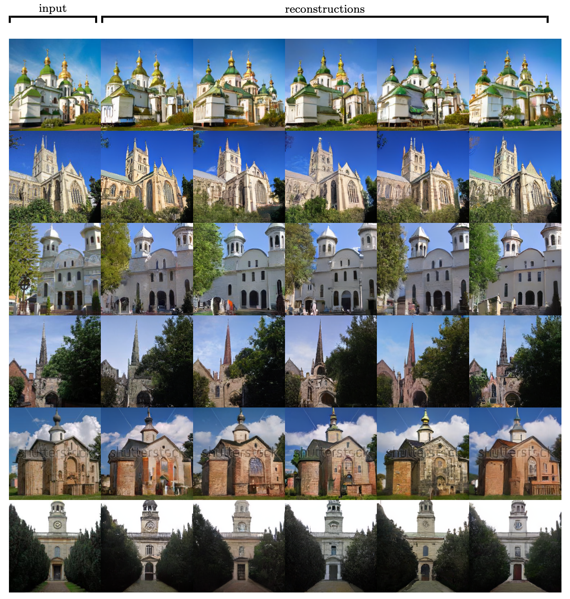
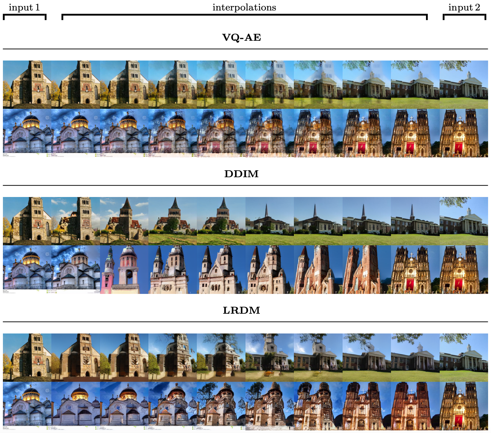

# Representation Learning with (Latent) Diffusion Models
This repository contains the code for the Master thesis "Representation Learning with Diffusion Models".

[arXiv](https://arxiv.org/abs/2210.11058) | [BibTeX](#bibtex)

<p align="center">

</p>

## Requirements
Checkout ``environment.yaml`` for suitable package versions or directly create and activate a [conda](https://conda.io/) environment via
```bash
conda env create -f environment.yaml
conda activate diffusion
conda install pytorch==1.10.1 torchvision==0.11.2 torchaudio==0.10.1 cudatoolkit=11.3 -c pytorch -c conda-forge
```

## Pretrained Models
For now, only the checkpoints for those LDMs, LRDMs, t-LRDMs trained on LSUN-Churches are available for download.

You can download all checkpoints via [https://k00.fr/representationDM](https://k00.fr/representationDM). The corresponding configuration files should be stored in the same directory as the model checkpoint. Note that the models trained in a reduced latent space also require the corresponding ``first_stage`` model.

## Evaluation Scripts
Various evaluation scripts are provided in the ``scripts`` directory. For full configurability, please checkout the available CLI arguments.

### Unconditional Sampling
Unconditional samples can be generated by running
```bash
CUDA_VISIBLE_DEVICES=<GPU_ID> python scripts/sampling.py -r <path-to-model-checkpoint>
# Create sampling progression via
CUDA_VISIBLE_DEVICES=<GPU_ID> python scripts/sampling.py -r <path-to-model-checkpoint> -n 2 -progr
```


### Reconstructions & Interpolations
Reconstructions of input images from the encoded representations can be generated by running
```bash
CUDA_VISIBLE_DEVICES=<GPU_ID> python scripts/repr_reconstructions.py -r <path-to-model-checkpoint> --n_inputs=4 --n_reconstructions=4
```

In order to interpolate in representation space, run
```bash
CUDA_VISIBLE_DEVICES=<GPU_ID> python scripts/repr_interpolations.py -r <path-to-model-checkpoint> -n 2
```





### Style-Shape Separating LRDM

🚧 WIP

## Train your own Models

### Data preparation

For downloading and preparing the LSUN-Churches dataset, proceed as described in the [latent-diffusion](https://github.com/CompVis/latent-diffusion#lsun) repository.

### Model Training

Logs and checkpoints for trained models are saved to ``logs/<START_DATE_AND_TIME>_<config-name>``.

Various training configuration files are available in ``configs/``. Models can be trained by running
```bash
CUDA_VISIBLE_DEVICES=<GPU_ID> python main.py --base configs/<path-to-config>.yaml -t --gpus 0, -n <name>
```
where ``<name>`` is a custom name of the corresponding log-directory (optional).

## Comments
* The implementation is based on [https://github.com/openai/guided-diffusion](https://github.com/openai/guided-diffusion) and [https://github.com/yang-song/score_sde_pytorch](https://github.com/yang-song/score_sde_pytorch).

## BibTex

```
@misc{https://doi.org/10.48550/arxiv.2210.11058,
    doi = {10.48550/ARXIV.2210.11058},
    url = {https://arxiv.org/abs/2210.11058},
    author = {Traub, Jeremias},
    keywords = {Computer Vision and Pattern Recognition (cs.CV), FOS: Computer and information sciences, FOS: Computer and information sciences},
    title = {Representation Learning with Diffusion Models},
    publisher = {arXiv},
    year = {2022},
    copyright = {arXiv.org perpetual, non-exclusive license}
}
```
